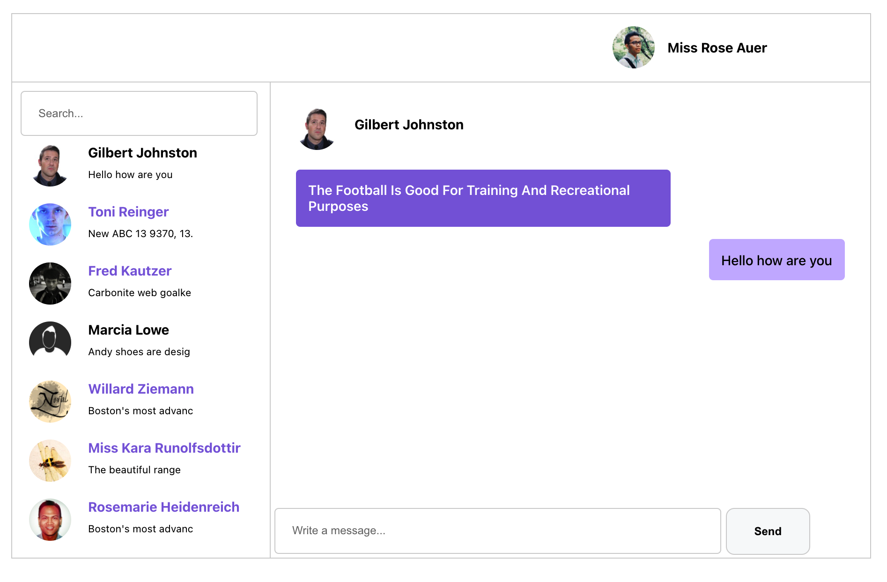

## Task Details

Tech used: React, Javascript, Vanilla CSS, faker.js

Demo chat app with below client-side working features

1) Search contact list by name: you can type a contact name in search and can see contact list filters by search term (case insensitive)
2) click on a contact from a list(left side) and chat with contact (use Enter key or click Send button to send messages)
3) when you click on other contact, last contact shows the last entered message (in left side below contact names)
4) active state: all unread contact's messages are shown in purple (upon read, Contact name changes to Black font color)
5) mouse hover on contact list highlights contact with pointer cursor
6) used faker.js for the contact names and their last messages
7) used React useContext to store the state that is shared with sub components

### Running a local version of the app

- Launch the app
	- > `npm start`
		

## Applications Stack configurations and informations

### CLIENT
- React
- Active on PORT 3000
- [localhost:3000](http://localhost:3000)
